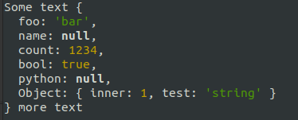

# pretty-clipboard

Pretty print JSON like objects found in the clipboard to console.

Also dumps JSON found within strings recursively.

## Installation

```bash
npm install -g pretty-clipboard
```

## Usage

Say you have some JSON-like string in your clipboard among other text

```txt
Some text {'foo': "bar", name: null, count: 1234, bool: true, python: None, "Object": { inner: 1, test: 'string'} } more text
```

You can pretty print it to the console using inspect with

```bash
pc
```

Gives output



To pretty print a correctly stringified JSON object, use `jc` instead (no colours)

```bash
jc
```

## Bonus

`uc` will unescape the clipboard contents (e.g. `\n` to newline, `\t` to tab, etc.`)

```bash
uc
```

## Notes

Repairs common JSON errors like single quotes, missing quotes, trailing commas, missing commas.

Also repairs quoted keys and values e.g. as used in Kibana logs.
